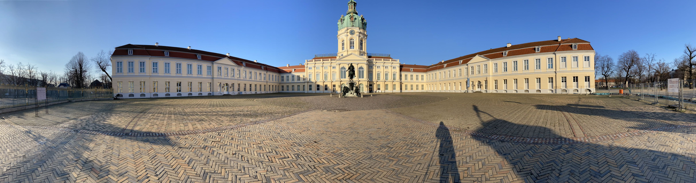

# Event Camera Rotation Dataset (ECRot Dataset)
A event camera dataset for rotational motion study

## News

- TODO

## About

The Event Camera Rotation Dataset (ECRot) is an event camera dataset designed for the development of event-based rotational motion related algorithms. ECRot contains totally ten sequences recorded with a DVXplorer (VGA resolution: 640 X 480 pixels) from [iniVation](https://inivation.com/). We provide all sequences in rosbag files that contain events using [dvs_msgs/EventArray](https://github.com/uzh-rpg/rpg_dvs_ros/blob/master/dvs_msgs/msg/EventArray.msg) message types, and IMU data using [sensor_msgs/Imu](http://docs.ros.org/en/api/sensor_msgs/html/msg/Imu.html) message types respectively. The calibration files are provided in yaml files. We generate rotational motion of the event camera in two modes: Motorized mount (7 sequences) and Hand-held (3 sequences). The Motorized mount rotates the event camera approximately in a horizontal plane, while the rotation center still deviates a little from the camera's optical center. For the Hand-held cases, there are some irregular translations. To show the advantages of event cameras over standard cameras, these sequences contain challenging illumination conditions (e.g., looking directly at the sun, reflections in the river and windows) as well as dynamic objects (e.g., moving pedestrians, bicycles, cars, leaves and water on the river).

## Sequences

### Scenes

- Brandenburg Gate

- Charlottenburg Palace

- Victory Column

- TU Berlin Main Building

- TU Berlin MAR Building

- Square Center

- Square Side

- Crossroad

- River

- Bridge

### Description

| Sequence | Camera carrier | Duration [s] | Rotation range [deg] |
| :-----| :-----| ----: | ----: |
| Brandenburg Gate | Motorized mount | 8.0 | 360 |
| Charlottenburg Palace | Motorized mount | 8.4 | 360 |
| Victory Column | Motorized mount  | 10.0 | 90 |
| TU Berlin Main Building | Motorized mount | 8.5 | 360 |
| TU Berlin MAR Building | Motorized mount | 4.0 | $\approx$ 90 |
| Square Center | Motorized mount  | 8.8 | 360 |
| Square Side | Motorized mount | 8.0 | 360 |
| Crossroad | Hand-held | 10.2 | 360 |
| River | Hand-held | 5.5 | random |
| Bridge | Hand-held | 7.5 | random |

### Calibration

- TODO

## Publications

- Coming soon...

## License

 - TODO
