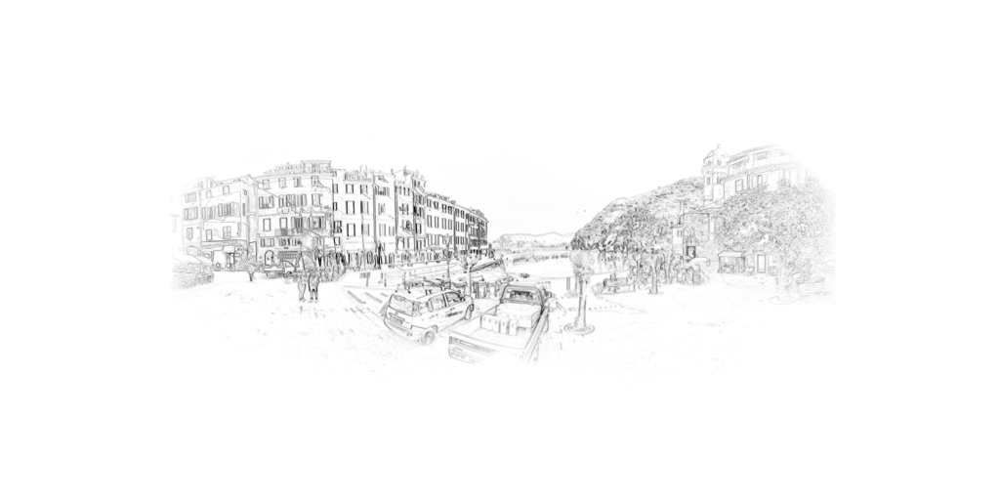

# Event Camera Rotation Dataset (ECRot)
The Event Camera Rotation Dataset (ECRot) is a VGA-resolution event camera dataset designed for the development of event-based rotational motion related algorithms. ECRot contains ten sequences recorded with a DVXplorer (640 x 480 pixels) from [iniVation](https://inivation.com/). We provide all sequences in ROSbag files that contain events using [dvs_msgs/EventArray](https://github.com/uzh-rpg/rpg_dvs_ros/blob/master/dvs_msgs/msg/EventArray.msg) message types, and IMU data using [sensor_msgs/Imu](http://docs.ros.org/en/api/sensor_msgs/html/msg/Imu.html) message types respectively. The camera calibration files are provided in yaml files.

Rotational motion is generated in two modes: Motorized mount (7 sequences) and Hand-held (3 sequences). The motorized mount rotates the event camera approximately around its vertical axis, while the rotation center slightly deviates from the camera's optical center. In the hand-held sequences, there are also some minor unavoidable translations. To show the advantages of event cameras over standard cameras, these sequences contain challenging illumination conditions (e.g., looking directly at the sun, reflections in the river and windows) as well as dynamic objects (e.g., moving pedestrians, bicycles, cars, leaves and water on the river).

## News

- Update [26.08.2023]: we added six synthetic sequences generated by [the ESIM simulator](https://github.com/uzh-rpg/rpg_esim). The input panoramas are downloaded [from the Internet](https://www.flickr.com/groups/equirectangular/pool/). The generated sequences cover indoor, outdoor, daylight, night, human-made and natural scenarios. The size of the input panoramas varies from 2K (flying room), 4K (bicycle), 6K (city and street), to 7K (town and bay) resolution.

## Sequences

### Synthetic data

| Sequence | Camera model | Duration [s] | File size |
| :-----| :-----| ----: | ----: |
| [Flying room](https://drive.google.com/drive/folders/1DWuEsDUWJBxwpPoZSOvpZrtZ9iMNMlfB?usp=sharing) | DVS128 | 2.5 | 47.8 MB |
| [Bicycle](https://drive.google.com/drive/folders/1P3xt38J1QuXpk3RZ-LO1znu7LR7uare2?usp=sharing) | DAVIS240C | 5.0 | 264.3 MB |
| [City](https://drive.google.com/drive/folders/1w4AEgAAlrUZORWa6ajPDGoqkTv8TozNm?usp=sharing) | DAVIS240C | 5.0 | 1.0 GB |
| [Street](https://drive.google.com/drive/folders/1gAAN5gNLrR_4gsDIgGqy84xtuFcR6yLA?usp=sharing) | DAVIS240C | 5.0 | 699.1 MB |
| [Town](https://drive.google.com/drive/folders/1YQE0CnuUfdWj-iDtff9zhu2O1V4o7NQX?usp=sharing) | DAVIS240C | 5.0 | 743.6 MB |
| [Bay](https://drive.google.com/drive/folders/1af7U1l2eKo7OiBi10kZrpcSexxDtSZqI?usp=sharing) | DAVIS240C | 5.0 | 827.7 MB |

### Real-world data

| Sequence | Setup | Duration [s] | Rotation range [deg] | File size |
| :-----| :-----| ----: | ----: | ----: |
| [Brandenburg Gate](https://drive.google.com/drive/folders/1k8C2ngoSKyy9yZOoFwEZWAGs2Utygz5Z?usp=sharing) | Motorized mount | 8.0 | 360 | 1.40 GB |
| [Charlottenburg Palace](https://drive.google.com/drive/folders/1_1tGqoZB4BnVk4Vt4OnlNTCKV4oXzWw1?usp=sharing) | Motorized mount | 8.4 | 360 | 1.18 GB |
| [Victory Column](https://drive.google.com/drive/folders/1MbKtWNnaJ_l4iKyW8M0FA6McqKv-X3nc?usp=sharing) | Motorized mount  | 10.0 | 90 | 62.2 MB |
| [TU Berlin Main Building](https://drive.google.com/drive/folders/1LSo-IyDAQdHpMJwYjzcVXaM6Yms-8X6k?usp=sharing) | Motorized mount | 8.5 | 360 | 1.41 GB |
| [TU Berlin MAR Building](https://drive.google.com/drive/folders/1uX4DrY5YoCCyEClXmNiE90_fpoZIrED6?usp=sharing) | Motorized mount | 4.0 | $\approx$ 90 | 421 MB |
| [Square Center](https://drive.google.com/drive/folders/18gVBZSuy2qbyLIwg0kNjVy3_1gkuslia?usp=sharing) | Motorized mount  | 8.8 | 360 | 1.37 GB |
| [Square Side](https://drive.google.com/drive/folders/14hbk54NcUG6uOrsdKqaOzDprQyaxyvNX?usp=sharing) | Motorized mount | 8.0 | 360 | 1.46 GB |
| [Crossroad](https://drive.google.com/drive/folders/1skZ2LNLBMXbtJaWzy2ijKtlHXYZ9SwAA?usp=sharing) | Hand-held | 10.2 | 360 | 792 MB |
| [River](https://drive.google.com/drive/folders/1USBO6u9tgF-YVMqNABKMDEQwa3peOlH5?usp=sharing) | Hand-held | 5.5 | random | 862 MB |
| [Bridge](https://drive.google.com/drive/folders/1BArPM4voy290iZDDwnoOaBlLZ-YdTQqH?usp=sharing) | Hand-held | 7.5 | random | 1.08 GB |

### Intrinsic calibration of the event camera:

- Synthetic data
  * [DVS128-synthetic](https://drive.google.com/file/d/1Cd_CvFuUTqtJnRkMbV2X4b-4vEC6oRmo/view?usp=sharing)

  * [DAVIS240C-synthetic](https://drive.google.com/file/d/1Z9i30YX0PjeOq8b8kTxdP05MXX3ForA7/view?usp=sharing)

- Real-world data
  * [DVX-motorized_mount](https://drive.google.com/file/d/1NqmTqD_S-3Ff0YsgIvEJdnzrZ4Lu0lNy/view?usp=sharing)

  * [DVX-handheld](https://drive.google.com/file/d/1c12Y8s3klhSWhw8D5xvoi7zOqdrMDt4m/view?usp=sharing)

### Synthetic scenes ([from the Internet](https://www.flickr.com/groups/equirectangular/pool/))

The panoramas used to generate synthetic sequences and the panoramic Images of Warped Events (IWEs) produced by CMax-SLAM are presented as below.

- Flying room

- Bicycle

- City

- Street

- Town

- Bay

### Real-world scenes (from an RGB frame-based camera)

The panoramas captured by an iPhone 11 and the panoramic Images of Warped Events (IWEs) produced by CMax-SLAM are presented as below.

- [Brandenburg Gate](https://en.wikipedia.org/wiki/Brandenburg_Gate)

- [Charlottenburg Palace](https://de.wikipedia.org/wiki/Schloss_Charlottenburg)

- [Victory Column](https://en.wikipedia.org/wiki/Berlin_Victory_Column)

- TU Berlin Main Building

- TU Berlin MAR Building

- Square Center

- Square Side

- Crossroad

- River

- Bridge

## Acknowledgements
Ms. Nan Cai (for assistance on the motorized sequences) and Mr. Yunfan Yang (for assistance with the hand-held sequences).

## Publications

- Coming soon...

## License

- Coming soon...
